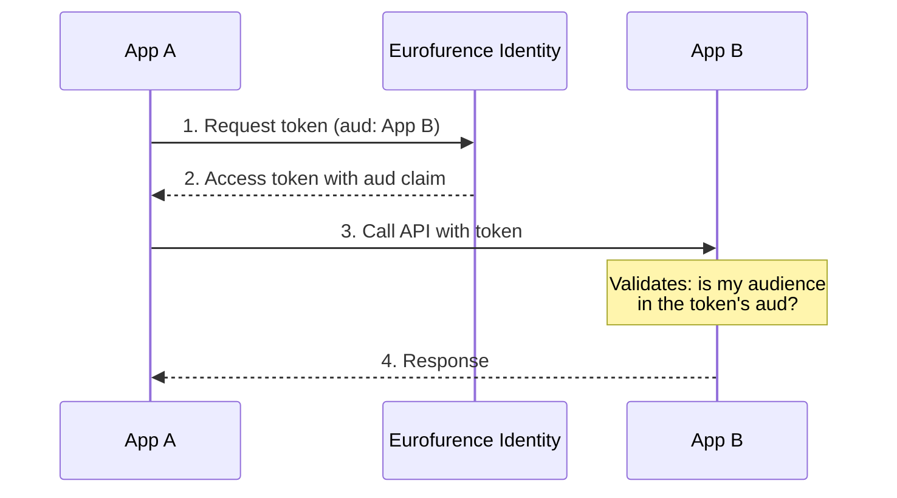

# Audiences

Audiences control **where** a token can be used. While [scopes](/identity/concepts/scopes) define what an app can do, audiences define which service should accept the token. This prevents a token meant for one service from being replayed against another.

## How It Works

Every application registered with Eurofurence Identity has an **audience identifier**: a unique string that represents the application as a token recipient.

When requesting a token, the caller specifies which audience(s) the token is for. The receiving service then checks that its own audience identifier is listed in the token's `aud` claim before accepting it.



## Audience Identifier Format

Audiences use a **reverse domain notation**, similar to Java packages or Android app IDs. This keeps identifiers stable and independent of infrastructure like domain names.

```
org.eurofurence.{app-name}
```

For example:

| App | Audience |
|-----|----------|
| Registration System | `org.eurofurence.registration` |
| Dealer's Den | `org.eurofurence.dealers-den` |
| Art Show | `org.eurofurence.art-show` |
| Identity | `org.eurofurence.identity` |

### Rules

| Rule | Example |
|------|---------|
| Reverse domain prefix | `org.eurofurence.` for all Eurofurence apps |
| Lowercase, kebab-case app name | `dealers-den` not `DealersDen` |
| One audience per app | Don't share audiences across apps |
| No trailing dots or slashes | `org.eurofurence.registration` |

## Client Credentials (App-to-App)

The client credentials flow allows applications to communicate directly without a user context. This is useful for background services, scheduled jobs, or any service-to-service communication.

### How It Works

1. The calling app authenticates with its `client_id` and `client_secret`
2. It requests a token with the target app's audience
3. The target app validates the token's `aud` claim

```bash
curl -X POST https://identity.eurofurence.org/oauth2/token \
  -d grant_type=client_credentials \
  -d client_id=YOUR_CLIENT_ID \
  -d client_secret=YOUR_CLIENT_SECRET \
  -d scope=registration.all.read \
  -d audience=org.eurofurence.registration
```

The resulting token is bound to the **application**, not a user. On introspection, the `sub` claim will be the `client_id`.

### Allowed Audiences

Each client is registered with a list of audiences it is permitted to request. A token request for an audience not in this list will be rejected.

For example, if App A is registered with:

```json
{
  "audience": [
    "org.eurofurence.registration",
    "org.eurofurence.dealers-den"
  ]
}
```

Then App A can request tokens for the registration system and dealer's den, but not for any other service.

:::tip
Request a separate token for each service you need to call. A token with multiple audiences has a wider blast radius if leaked.
:::

### Validating Tokens

When your app receives a request with a bearer token, validate it by calling the introspection endpoint and checking:

1. The token is `active`
2. Your audience identifier is in the `aud` claim
3. The required scopes are present

```bash
curl -X POST https://identity.eurofurence.org/admin/oauth2/introspect \
  -d token=THE_ACCESS_TOKEN
```

## ID Token vs Access Token Audiences

These are two different things:

- **ID Token** `aud` is always the `client_id` of the app that requested it. This is required by the OpenID Connect spec and cannot be changed.
- **Access Token** `aud` is set based on the `audience` parameter in the token request. This is what you use for service-to-service validation.

## Registering an Audience

To register an audience for your application or to configure which audiences your app can request, contact [Thiritin on Telegram](https://t.me/thiritin).
