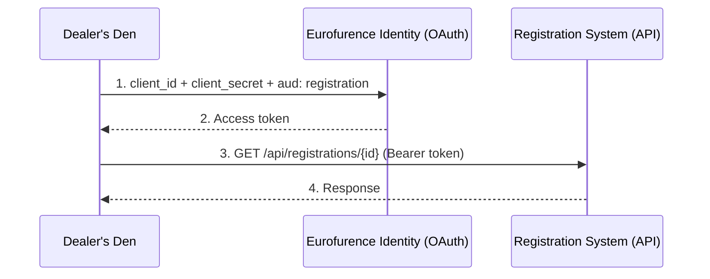

# App-to-App APIs

Eurofurence services need to talk to each other. The registration system might need to check group memberships via Identity, or the Dealer's Den might need to verify a registration status. This guide explains how service-to-service communication is secured.

## Overview

App-to-app communication uses the **Client Credentials Grant** ([RFC 6749 §4.4](https://datatracker.ietf.org/doc/html/rfc6749#section-4.4)) combined with **audiences** to ensure that:

- Only authorized apps can call your API
- Tokens are scoped to a specific target service
- A token meant for one service can't be replayed against another

The Client Credentials Grant is the OAuth 2.0 flow where a service logs in with its own `client_id` and `client_secret`, with no user involved. The service *is* the one being authenticated, and the resulting access token represents the service itself. Whenever this guide says "the app gets a token" or "service-to-service token", that's the Client Credentials Grant in action.

If you're not familiar with audiences, read the [Audiences](/identity/guides/audiences) guide first.

## How It Works



1. The calling service authenticates with its own credentials
2. It receives a token with the target service's audience in the `aud` claim
3. It calls the target service's API with the token
4. The target service validates the token before responding

## Example: Dealer's Den Calls Registration

The Dealer's Den needs to look up a dealer's registration data to confirm they have a valid, paid attendance.

### Step 1: Request a Token

```bash
curl -X POST https://identity.eurofurence.org/oauth2/token \
  -d grant_type=client_credentials \
  -d client_id=DEALERS_DEN_CLIENT_ID \
  -d client_secret=DEALERS_DEN_CLIENT_SECRET \
  -d scope=registration.all.read \
  -d audience=org.eurofurence.registration
```

Response:

```json
{
  "access_token": "eyJ...",
  "expires_in": 3600,
  "token_type": "bearer"
}
```

### Step 2: Call the API

```bash
curl -H "Authorization: Bearer eyJ..." \
  https://reg.eurofurence.org/api/registrations/some-user-id
```

### Step 3: Registration Validates the Token

Before responding, the Registration system [introspects the token](/identity/api/v2/introspect-token) by calling the `/oauth2/introspect` endpoint with the bearer token, and checks:

1. `active` is `true`, meaning the token hasn't expired or been revoked
2. `aud` contains `org.eurofurence.registration`, meaning the token was issued for this service
3. The required scope (`registration.all.read`) is present in the `scope` claim

If any check fails, the request is rejected with `401` or `403`.

Your own service should do the same when it receives a token. See [Validating Tokens](/identity/guides/audiences#validating-tokens) for the exact steps.

## Security Model

### What Prevents Misuse

| Threat | Protection |
|--------|-----------|
| App A uses a token meant for App B | Audience validation: App B rejects tokens without its audience |
| App A requests a token for an unauthorized service | Audience allow list: Hydra rejects the token request |
| App A requests scopes it shouldn't have | Scope allow list: Hydra only grants scopes the client is registered for |
| Leaked token used against unrelated service | Audience + scope together limit the blast radius |

### No User Context

Client credentials tokens have **no user context**. The `sub` claim is the `client_id`, not a user. This means:

- The calling app acts as itself, not on behalf of a user
- User-level permissions don't apply; the receiving service should treat this as a trusted service call
- If you need to act on behalf of a specific user, pass the user identifier as a request parameter, not through the token

:::caution
Store client secrets securely. Treat them like database passwords: use environment variables or a secrets manager, never commit them to source control.
:::

## Token Caching

Client credentials tokens have a fixed expiry (`expires_in`). Cache them until they expire to avoid unnecessary token requests.

```
Token received at 10:00:00
expires_in: 3600

Cache until ~10:59:00 (with a small buffer)
Request a new token at 10:59:00
```

Don't request a new token for every API call. This adds unnecessary load on the OAuth server and latency to your requests.

## Registering Your Service

To set up app-to-app communication, contact [Thiritin on Telegram](https://t.me/thiritin) with:

| Field | Description |
|-------|-------------|
| **Your app's audience** | The reverse domain identifier for your service (e.g. `org.eurofurence.dealers-den`) |
| **Target audiences** | Which services your app needs to call |
| **Required scopes** | Which scopes your app needs on those services |
