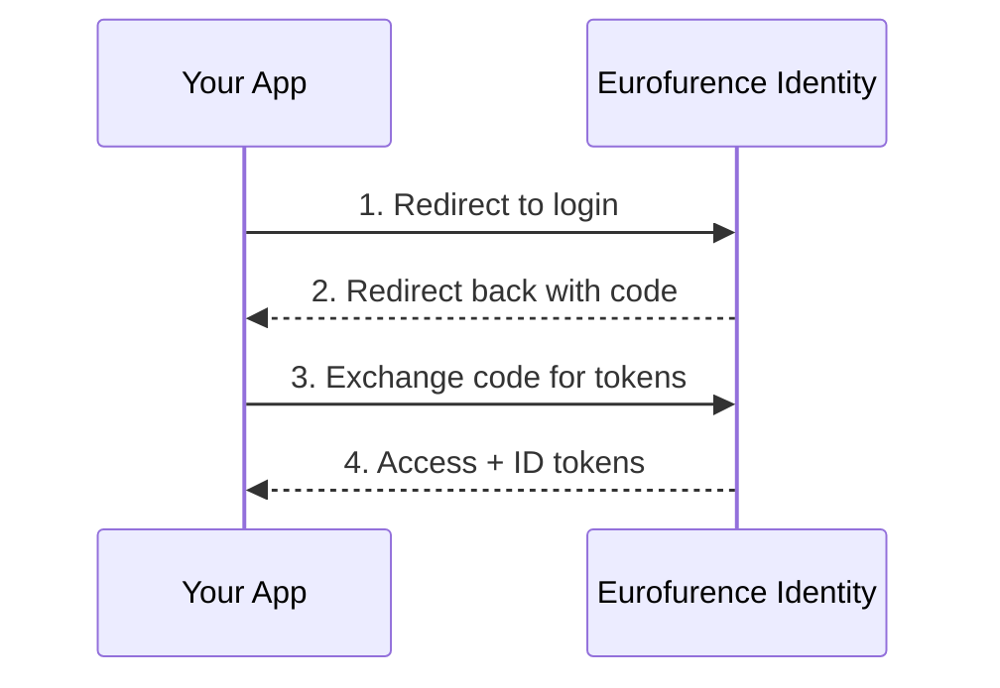

# Build an Application

This guide explains how to integrate your application with Eurofurence Identity for authentication and authorization.

## How It Works

Eurofurence Identity implements **OpenID Connect (OIDC)**, which is built on top of **OAuth 2.0**. Here's what that means in simple terms:

- **OAuth 2.0** lets your app request access to a user's data without ever seeing their password. The user logs in on our side, approves your app, and we give your app a token it can use to access the data it was approved for.
- **OpenID Connect** adds an identity layer on top of OAuth 2.0. Besides getting access to data, your app also gets a verified identity: who the user is, their email, their display name, etc.

Think of it like a hotel key card system: the front desk (Eurofurence Identity) verifies who you are and gives you a key card (token) that only opens the doors (scopes) you're allowed to access.

## Authentication Flow



1. Your app redirects the user to Eurofurence Identity's login page
2. The user logs in and approves your app's requested permissions
3. We redirect back to your app with an authorization code
4. Your app exchanges that code for access tokens (server-side)

## Registering Your Application

Before you can integrate, you need to register your application as an OAuth2 client. Contact [Thiritin](https://t.me/thiritin) via Telegram to request a new client.

You will need to provide:

| Field | Description |
|-------|-------------|
| **App Name** | Display name shown to users during consent |
| **Redirect URIs** | Where we send users after login (e.g. `https://yourapp.com/callback`) |
| **Privacy Policy URL** | A publicly accessible privacy policy. **Required for external (non-first-party) applications.** |
| **Requested Scopes** | Which permissions your app needs (see below) |

### Privacy Policy Requirement

External (non-first-party) applications **must** have a privacy policy that explains:

- What user data your app collects and stores
- How that data is used
- How users can request deletion of their data
- Contact information for privacy concerns

This is both an Eurofurence e.V. requirement and a legal requirement under GDPR.

## Available Scopes

Scopes define what your app can access. Only request what you actually need. See the [Scopes Reference](/identity/guides/scopes) for the full list, guidance on choosing scopes, and common examples.

## Tokens

After successful authentication, your app receives:

- **ID Token:** A JWT containing the user's identity claims (sub, name, email, etc.). This token includes a `sid` (session ID) claim used for backchannel logout.
- **Access Token:** Used to call the Eurofurence Identity API on behalf of the user.
- **Refresh Token:** (If `offline`/`offline_access` scope was requested) Used to get new access tokens without re-authenticating.

## Backchannel Logout

Eurofurence Identity supports **OpenID Connect Backchannel Logout**. This means when a user logs out from any application, all other applications they're logged into get notified server-to-server.

### How It Works

1. User clicks "Logout" in any connected application
2. Eurofurence Identity sends a `logout_token` (JWT) to every registered application's backchannel logout URI
3. The `logout_token` contains the `sid` (session ID) from the original ID Token
4. Your app matches the `sid` to find and destroy the local session

### Implementation

When registering your app, provide a **Backchannel Logout URI** (e.g. `https://yourapp.com/backchannel-logout`).

Your endpoint must:

1. Accept `POST` requests with `Content-Type: application/x-www-form-urlencoded`
2. Extract the `logout_token` from the request body
3. Validate the JWT signature and claims
4. Find the session matching the `sid` claim
5. Destroy that session
6. Return HTTP `200` on success

```
POST /backchannel-logout HTTP/1.1
Content-Type: application/x-www-form-urlencoded

logout_token=eyJhbGciOiJSUzI1NiIs...
```

The `logout_token` JWT payload looks like:

```json
{
  "iss": "https://identity.eurofurence.org/",
  "sub": "user-uuid",
  "aud": "your-client-id",
  "iat": 1234567890,
  "jti": "unique-token-id",
  "events": {
    "http://schemas.openid.net/event/backchannel-logout": {}
  },
  "sid": "session-id-from-id-token"
}
```

:::tip
Store the `sid` from the ID Token when the user logs in so you can match it later when a backchannel logout request arrives.
:::

## User Metadata API

Your app can store per-user key-value data scoped to your client ID. This is useful for app-specific preferences or state that should persist across sessions.

- Keys are scoped by your OAuth `client_id`; you can only access your own data
- Values are strings up to 64KB
- See the [API Reference](/identity/api/v1/eurofurence-identity) for endpoint details

## Example Integration

Here's a minimal example using a standard OAuth2/OIDC library:

```
Authorization URL: https://identity.eurofurence.org/oauth2/auth
Token URL:         https://identity.eurofurence.org/oauth2/token
Userinfo URL:      https://identity.eurofurence.org/api/v1/userinfo
OIDC Discovery:    https://identity.eurofurence.org/.well-known/openid-configuration
```

Most OAuth2/OIDC libraries can auto-configure themselves using the discovery URL above. Just point your library at it, and it will fetch all the endpoints automatically.

## Need Help?

- Reach out to [Thiritin on Telegram](https://t.me/thiritin)
- Check the [API Reference](/identity/api/v1/eurofurence-identity) for endpoint details
- Review the [OpenID Connect Discovery](https://identity.eurofurence.org/.well-known/openid-configuration) document
